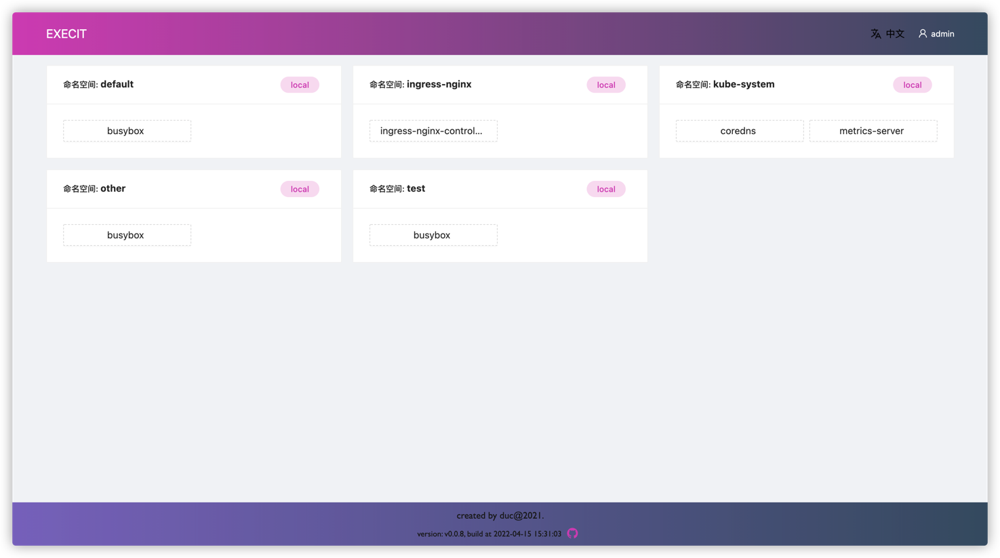
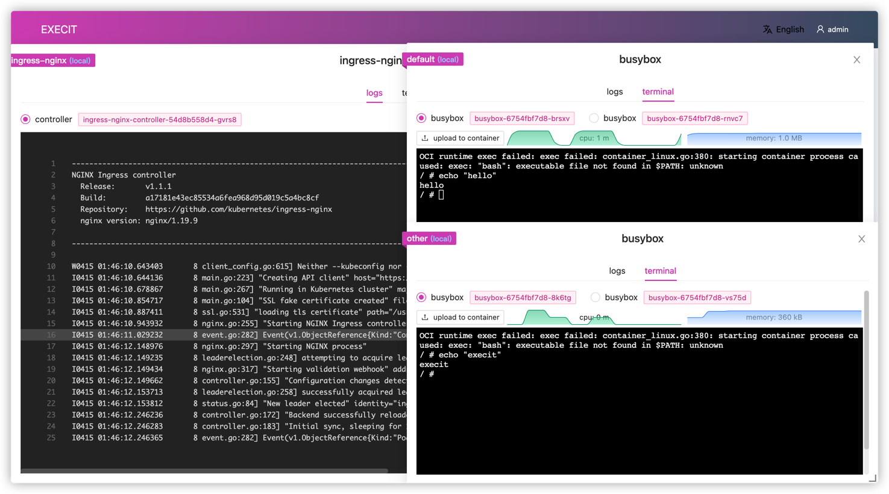
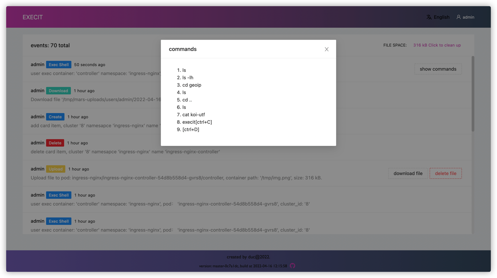

<h1 align="center">execit</h1>
<p align="center">exec any pod in one web page.</p>
<br><br>

## 💡 Intro

Super simple terminal management in k8s.

## ✨  Features

* multi cluster
* like kubernetes dashboard, but more simple and powerful.
* audit log.
* i18n.

## 🚀  Installation

```shell
kubectl apply -f https://raw.githubusercontent.com/duc-cnzj/execit/master/deploy.yaml

kubectl port-forward -n execit svc/execit 31996:80
```

username: `admin`, password: `123456`

open http://localhost:31996

## 💡 Minimum permissions required

| resource     | Verbs            |
| ------------ | ---------------- |
| pods         | `get`, `list`, `watch` |
| deployments  | `get`, `list`, `watch` |
| statefulSets | `get`, `list`, `watch` |
| pods/exec    | `create`         |


## 🧀 Preview





## TODO

- [x] Multi-cluster management
- [x] base on deployment, statefulset
- [ ] RBAC
- [ ] base permission for execit