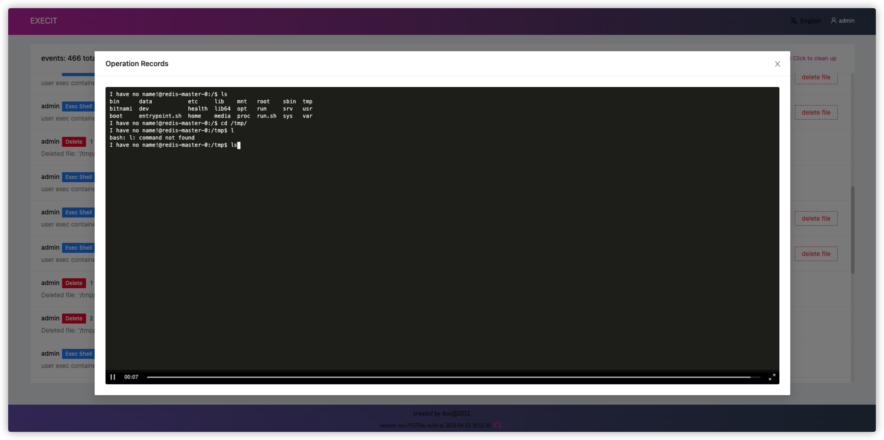

<h1 align="center">exec-it</h1>
<p align="center">exec pods in one web page.</p>
<br><br>

## 💡 Intro

Super simple terminal management tool in k8s.

## ✨  Features

* single pod web proxy.
* multi cluster
* like kubernetes dashboard, but more simple and friendly.
* audit log.
* i18n.

## 🚀  Installation

```shell
kubectl apply -f https://raw.githubusercontent.com/duc-cnzj/execit/master/deploy.yaml

kubectl port-forward -n execit svc/execit 31996:80
```

username: `admin`, password: `123456`

open http://localhost:31996

## 💡 Minimum permissions required

| Resource                               | Verbs                 |
|----------------------------------------|-----------------------|
| pods                                   | `get`, `list`, `watch` |
| deployments                            | `get`, `list`, `watch` |
| statefulsets                           | `get`, `list`, `watch` |
| job(optional)                          | `get`, `list`, `watch` |
| pods/exec                              | `create`              |
| pods/log                               | `get`                 |
| pods/portforward(single pod web proxy) | `create`    |
| metrics.k8s.io/pods(optional)          | `get`                 |

> The web proxy is only suitable for some web applications.
> 
> for example:
> 
> ✅ kiali, prometheus, minio, ceph-dashboard...
> 
> ❌ grafana...

## 🧀 Preview


